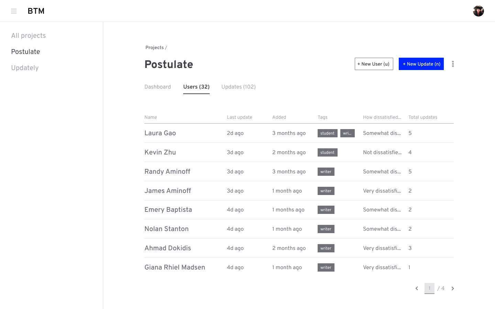
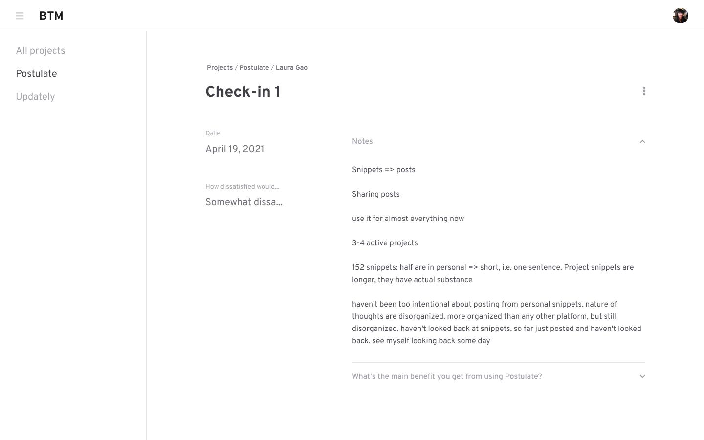

## Beta Testing Manager

An all-in-one tool for keeping track of beta testers.

Built on Next.js and MongoDB, in partnership with [Samson Zhang](https://twitter.com/wwsalmon). Check out [these dev notes](https://postulate.us/@samsonzhang/betatestingmanager) for more details on the development process 😁